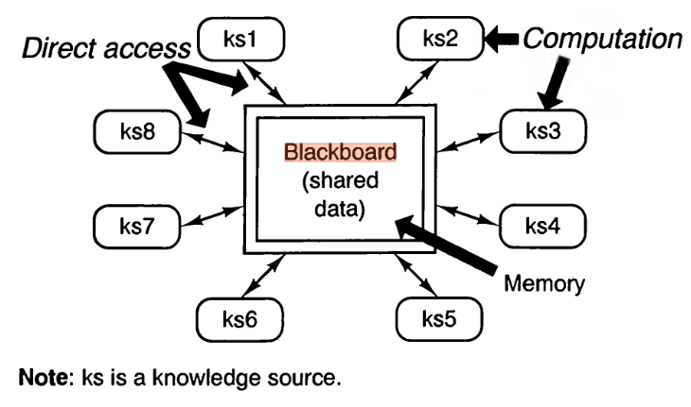

# Architecture

## Blackboard Repository

>I found that the best architecture match for this project would be Blackboard Repository. My reasoning for this is because : 
* It allows all the mechanics of the game to be seperated and later combined
* Allows for a return to a previous point in time should significant errors occur
* Would allow one to easily jump in between multiple solutions should seperate mechanics need to be worked on at a time
* Allows a central storage to keep the progress of the project saved incase of a computer crash/available to work at a different location if desired

