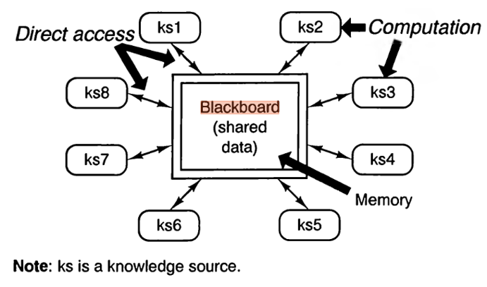

# Design Document

> As seen above the blackboard repository the center would represent the overall project while the rectangles marked KS(knowledge base) represent contributions/solutions made to solve the problems of the project. 
